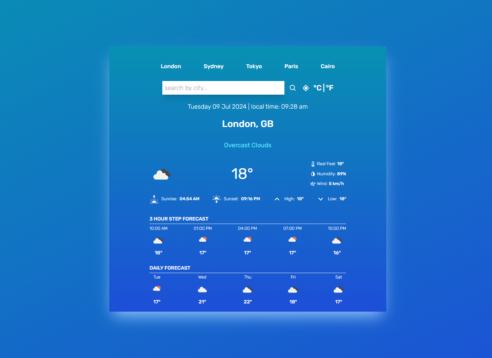

<h1 align="center">Weather Application Project</h1>

<a href="https://github.com/Amr-Elshabrawy-Dev/AkiraStore" target="_blank">

</a>

### 👁️ Project Preview

- [Live Preview 👉 https://amr-elshabrawy-dev.github.io/weather-app](https://amr-elshabrawy-dev.github.io/weather-app)

- [Github Repo 👉 https://github.com/Amr-Elshabrawy-Dev/weather-app](https://github.com/Amr-Elshabrawy-Dev/weather-app)

- 🚩 For any reason <a target="_blank" href="mailto:amrelshabrawy.dev@gmail.com">contact me.</a>

---

## 👏 Introduction

This project is a weather application built using React. The application fetches weather data through an API and displays it to the user. It also uses a state management system to store weather data and improve performance.

---

## 🛠️ Tools and Technologies Used

### React

- **📝 Description**: A library for building user interfaces.
- **👨‍🍳 Usage**: React was used to create the UI components, manage state, and handle user interactions.

### useContext

- **📝 Description**: Part of React for managing global state.
- **👨‍🍳 Usage**: useContext was used to store and share weather data between different components.

### useState

- **📝 Description**: A hook for managing local state in functional components.
- **👨‍🍳 Usage**: useState was used to manage local states such as `query`, `units`, and `message`.

### useEffect

- **📝 Description**: A hook for performing side effects in functional components.
- **👨‍🍳 Usage**: useEffect was used to perform data fetching operations when the `query` and `units` state changes.

### useCallback

- **📝 Description**: A hook to optimize functions that depend on stable references.
- **👨‍🍳 Usage**: useCallback was used to optimize functions such as `handleLocation` and `fetchWeather`.

### useMemo

- **📝 Description**: A hook to optimize computed values that depend on stable references.
- **👨‍🍳 Usage**: useMemo was used to compute the UI background based on the temperature.

### Fetch API

- **📝 Description**: An interface for fetching resources across the network.
- **👨‍🍳 Usage**: Fetch API was used to fetch weather data from the API.

### navigator.geolocation

- **📝 Description**: An interface for obtaining the user's geographical location.
- **👨‍🍳 Usage**: navigator.geolocation was used to get the user's coordinates to determine the weather location.

### Tailwind CSS

- **📝 Description**: A utility-first CSS framework for rapid UI development.
- **👨‍🍳 Usage**: Tailwind CSS was used to style the application, providing a responsive and modern design with minimal effort.

### React Icons

- **📝 Description**: A library for including popular icons in React projects.
- **👨‍🍳 Usage**: React Icons was used to include icons in the application, enhancing the visual appeal and user experience.

## ✨ Features

- **Interactive UI**: The application provides an interactive and user-friendly interface.
- **Efficient State Management**: Using Context API for state management makes it easy to share data between components.
- **Performance Optimization**: Using useCallback and useMemo helps improve the application's performance.
- **Error Handling**: The application handles errors well and displays appropriate messages to the user.
- **Device Compatibility**: The application uses geolocation to obtain the user's location, increasing the accuracy of the provided data.

## 🐛 Drawbacks

- **Internet Dependency**: The application relies entirely on an internet connection to fetch weather data.
- **Geolocation Error Handling**: If the user denies access to their location, a default location (like Cairo) is used, which may not be accurate for all users.

## How to Run

1. Install dependencies:

   ```bash
   npm install
   ```

2. Run project:

   ```bash
   npm run dev
   ```

---

### 👋 Get In Touch

- [🌐 My Website 👉 https://github.com/Amr-Elshabrawy-Dev](https://github.com/Amr-Elshabrawy-Dev)
- [👔 LinkedIn 👉 https://www.linkedin.com/in/amr-elshabrawy-dev](https://www.linkedin.com/in/amr-elshabrawy-dev)
- [🌟 Github 👉 https://github.com/Amr-Elshabrawy-Dev](https://github.com/Amr-Elshabrawy-Dev)
- [📧 Gmail 👉 amrelshabrawy.dev@gmail.com](mailto:amrelshabrawy.dev@gmail.com)
- [🐤 Twitter 👉 https://twitter.com/AmrElshbrawy217](https://twitter.com/AmrElshbrawy217)
- [☎️ Whatsapp 👉 (+20) 120-254-6653](https://api.whatsapp.com/send/?phone=%2B2001202546653&text&type=phone_number&app_absent=0)

---

   <div style="width: 100%;" align="center">
     <h3 style="font-size: 30px;">AMR ElSHABRAWY</h3>
     
     <p> Created by AMR Elshabrawy</p>
   </div>

---
